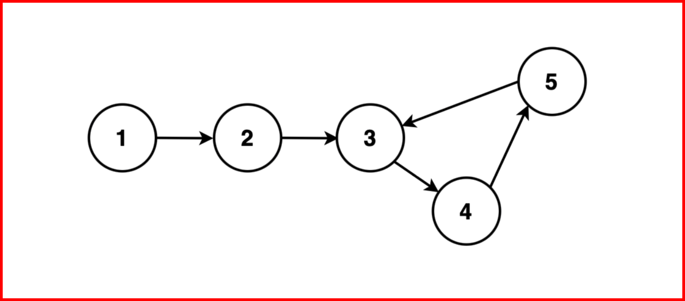

## Starting point of loop in a Linked List

### Given the head of a linked list that may contain a cycle, return the starting point of that cycle. If there is no cycle in the linked list return null.





```js
Example 1:
Input: LL: 1  2  3  4  5 
Output: 3
Explanation: This linked list contains a loop of size 3 starting at node with value 3.
```

## Algorithm

* #### Step 1: Initialise two pointers, `slow` and `fast`, to the head of the linked list. `slow` will advance one step at a time, while `fast` will advance two steps at a time. These pointers will move simultaneously.

* #### Step 2: Traverse the linked list with the `slow` and `fast` pointers. While traversing, repeatedly move `slow` one step and `fast` two steps at a time.

* #### Step 3: Continue this traversal until one of the following conditions is met:

* #### `fast` or `fast.next` reaches the end of the linked list (i.e., becomes null). In this case, there is no loop in the linked list, and the algorithm terminates by returning null.
* #### `fast` and `slow` pointers meet at the same node. This indicates the presence of a loop in the linked list.
* #### Step 4: Reset the `slow` pointer to the head of the linked list. Move `fast` and `slow` one step at a time until they meet again. The point where they meet again is the starting point.

```js
                            
// Node class represents a
// node in a linked list
class Node {
  constructor(data, next = null) {
    // Data stored in the node
    this.data = data; 
    // Pointer to the next node in the list
    this.next = next;      
  }
}

function firstNode(head) {
    // Initialize a slow and fast
    // pointers to the head of the list
    let slow = head;
    let fast = head;

    // Phase 1: Detect the loop
    while (fast !== null && fast.next !== null) {
        // Move slow one step
        slow = slow.next;
        // Move fast two steps
        fast = fast.next.next;

        // If slow and fast meet,
        // a loop is detected
        if (slow === fast) {
            // Reset the slow pointer
            // to the head of the list
            slow = head;

            // Phase 2: Find the first
            // node of the loop
            while (slow !== fast) {
                // Move slow and fast
                // one step at a time
                slow = slow.next;
                fast = fast.next;

                // When slow and fast meet again,
                 // it's the first node of the loop
            }

            // Return the first node of the loop
            return slow;
        }
    }

    // If no loop is found, return null
    return null;
}

// Create a sample linked list
// with a loop
const node1 = new Node(1);
const node2 = new Node(2);
node1.next = node2;
const node3 = new Node(3);
node2.next = node3;
const node4 = new Node(4);
node3.next = node4;
const node5 = new Node(5);
node4.next = node5;

// Make a loop from node5 to node2
node5.next = node2;

// Set the head of the linked list
const head = node1;

// Detect the loop in the linked list
const loopStartNode = firstNode(head);

if (loopStartNode) {
  console.log("Loop detected. Starting node of the loop is: " + loopStartNode.data);
} else {
  console.log("No loop detected in the linked list.");
}
                            
                        
```

## ✅Time Complexity: O(N) 
* #### The code traverses the entire linked list once, where 'n' is the number of nodes in the list. This traversal has a linear time complexity, O(n).

## ✅Space Complexity : O(1)
* #### The code uses only a constant amount of additional space, regardless of the linked list's length. This is achieved by using two pointers (slow and fast) to detect the loop without any significant extra memory usage, resulting in constant space complexity, O(1).