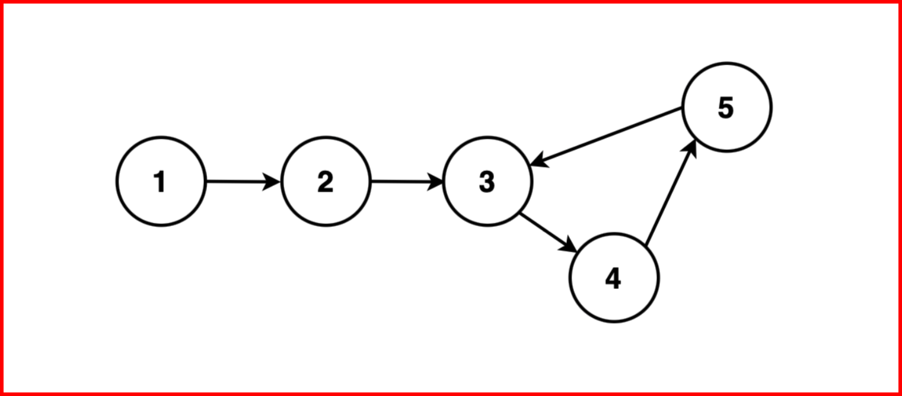

## Length of Loop in Linked List
### Given the head of a linked list, determine the length of a loop present in the linked list; if not present, return 0.




```js
Example 1:

Input Format:

LL: 1  2  3  4  5 
Output: 3
Explanation: A cycle exists in the linked list starting at node 3 -> 4 -> 5 and then back to 3. There are 3 nodes present in this cycle.
```

## Algorithm
* #### Step 1: Initialise two pointers, `slow` and `fast`, to the head of the linked list. `slow` will advance one step at a time, while `fast` will advance two steps at a time. These pointers will move simultaneously.

* #### Step 2: Traverse the linked list with the `slow` and `fast` pointers. While traversing, repeatedly move `slow` one step and `fast` two steps at a time.

* #### Step 3: Continue this traversal until one of the following conditions is met:

* #### `fast` or `fast.next` reaches the end of the linked list (i.e., becomes null). In this case, there is no loop in the linked list hence it is linear, and the algorithm terminates by returning 0.
* #### `fast` and `slow` pointers meet at the same node. This indicates the presence of a loop in the linked list as we have seen in the detection of loop.

```js

function Node(data1, next1) {
    // Data stored in the node
    this.data = data1;
    // Pointer to the next node
    // in the list
    this.next = next1 || null;
}

// Function to return the lenght
// of loop when slow and fast are
// on the same node
function findLength(slow, fast) {
    // count to keep track of 
    // nodes encountered in loop
    let cnt = 1;

    // move fast by one step
    fast = fast.next;
    
    // traverse fast till it 
    // reaches back to slow
    while (slow !== fast) {
        
        // at each node increase
        // count by 1 and move fast
        // forward by one step
        cnt++;
        fast = fast.next;
    }
    
    // loop terminates when fast reaches
    // slow again and the count is returned

    return cnt;
}

// Function to find the length
// of the loop in a linked list
function lengthOfLoop(head) {
    let slow = head;
    let fast = head;

    // Step 1: Traverse the list to detect a loop
    while (fast !== null && fast.next !== null) {
        // Move slow one step
        slow = slow.next;

        // Move fast two steps
        fast = fast.next.next;

        // Step 2: If the slow and fast pointers
        // meet, there is a loop
        if (slow === fast) {
            // return the number of nodes
            // in the loop
            return findLength(slow, fast);
        }
    }
    
    // Step 3: If the fast pointer
    // reaches the end, there is no loop
    return 0;
}

// Create a sample linked list with a loop
var head = new Node(1);
var second = new Node(2);
var third = new Node(3);
var fourth = new Node(4);
var fifth = new Node(5);

// Create a loop from fifth to second
head.next = second;
second.next = third;
third.next = fourth;
fourth.next = fifth;

// This creates a loop
fifth.next = second;

var loopLength = lengthOfLoop(head);

if (loopLength > 0) {
    console.log("Length of the loop:", loopLength);
} else {
    console.log("No loop found in the linked list.");
}

```