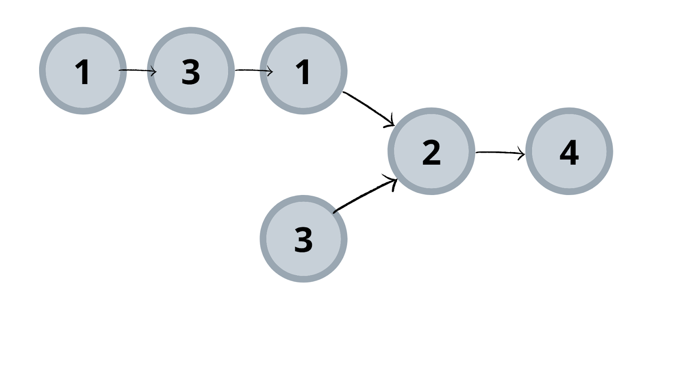

## Given the heads of two singly linked-lists headA and headB, return the node at which the two lists intersect. If the two linked lists have no intersection at all, return null.



```js
Example 1:
Input:
List 1 = [1,3,1,2,4], List 2 = [3,2,4]
Output:
2
Explanation: Here, both lists intersecting nodes start from node 2.
```

## Solution 1: Brute-Force

* #### Approach: We know intersection means a common attribute present between two entities. Here, we have linked lists as given entities. 

* #### What should be the common attribute for two linked lists? 

* #### If you believe a common attribute is a node's value, then think properly! If we take our example 1, there we can see both lists have nodes of value 3. But it is not the first intersection node. So what’s the common attribute?

* #### It is the node itself that is the common attribute. So, the process is as follows:-

* #### Keep any one of the list to check its node present in the other list. Here, we are choosing the second list for this task.
* #### Iterate through the other list. Here, it is the first one. 
* #### Check if the both nodes are the same. If yes, we got our first intersection node.
* #### If not, continue iteration.
* #### If we did not find an intersection node and completed the entire iteration of the second list, then there is no intersection between the provided lists. Hence, return null.
```js
class ListNode {
  constructor(val) {
    this.val = val;
    this.next = null;
  }
}

function getIntersectionNodeBruteForce(headA, headB) {
  let tempA = headA;

  while (tempA) {
    let tempB = headB;
    while (tempB) {
      if (tempA === tempB) return tempA; // Check if both nodes are the same reference
      tempB = tempB.next;
    }
    tempA = tempA.next;
  }

  return null;
}
```

## Time Complexity:
* #### O(M * N) (where M and N are the lengths of the two lists)

* #### Reason: For each node in list A, we traverse all nodes in list B.

## Space Complexity:
* #### O(1) (No extra space used)


## Solution 2: Optimised Using Two Pointers

* #### Initialize two pointers, ptrA and ptrB, at the heads of list A and list B.

* #### Traverse both lists:

* #### If ptrA reaches the end of list A, redirect it to headB.

* #### If ptrB reaches the end of list B, redirect it to headA.

* #### Continue iterating until:

* #### The pointers collide at the intersection node, OR

* #### Both pointers become null (indicating no intersection).

* #### The key idea is that both pointers traverse the same total length when redirected.

```js
class ListNode {
  constructor(val) {
    this.val = val;
    this.next = null;
  }
}

function getIntersectionNode(headA, headB) {
  if (!headA || !headB) return null;

  let ptrA = headA, ptrB = headB;

  while (ptrA !== ptrB) {
    // If ptrA reaches the end, redirect to headB
    ptrA = ptrA ? ptrA.next : headB;
    // If ptrB reaches the end, redirect to headA
    ptrB = ptrB ? ptrB.next : headA;
  }

  return ptrA; // Intersection node or null
}
```

## Time Complexity:
* #### O(M + N) (Each list is traversed at most twice)

## Space Complexity:
* #### O(1) (No extra space used)